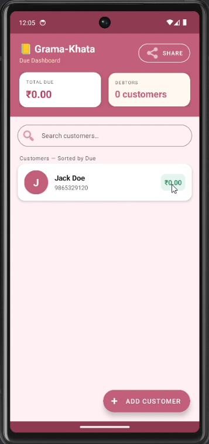
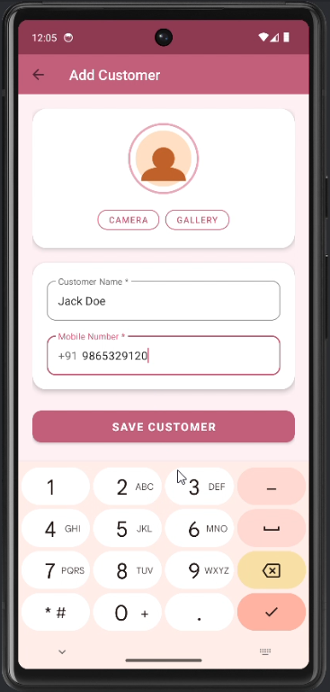

# 📒 Grama-Khata — Digital Village Ledger

<p align="center">
  
</p>

<p align="center">
  
  
  
  
  
</p>

---

# 📌 Project Overview

**Grama-Khata** is a modern Android application developed to digitize traditional village ledger systems used by small businesses, shopkeepers, and rural vendors.

The application helps users:
- Maintain customer records
- Track credit/debit transactions
- Monitor pending dues
- Generate collection reports
- Send payment reminders through WhatsApp/SMS

The app is designed with an **offline-first architecture** using **Room Database**, making it suitable for rural areas with limited internet connectivity.

---

# 🎯 Problem Statement

Traditional village bookkeeping methods rely heavily on paper records, which often lead to:
- Data loss
- Miscalculations
- Difficult tracking of dues
- Poor transaction management

Grama-Khata provides a secure and efficient digital alternative to simplify rural financial management.

---

# ✨ Key Features

| Feature | Description | Status |
|---------|-------------|--------|
| 👤 Customer Management | Add/Edit/Delete customer details with photos | ✅ |
| 💰 Credit Entry | Record money given on credit | ✅ |
| 💸 Payment Collection | Track received payments | ✅ |
| 📊 Net Balance Calculation | Real-time due balance updates | ✅ |
| 📈 Due Dashboard | Displays pending balances in sorted order | ✅ |
| 🔍 Search Customers | Quickly search customer records | ✅ |
| 📲 WhatsApp/SMS Reminder | Send payment reminders instantly | ✅ |
| 📅 Daily Collection Report | Track daily transactions | ✅ |
| 🧾 Transaction History | Complete history of all records | ✅ |
| 📴 Offline Support | Fully functional without internet | ✅ |

---

# 🛠 Tech Stack

| Technology | Purpose |
|------------|---------|
| **Kotlin** | Android App Development |
| **Room Database** | Offline Local Storage |
| **MVVM Architecture** | Scalable Architecture Pattern |
| **LiveData & ViewModel** | State Management |
| **RecyclerView** | Dynamic Lists |
| **Material Design 3** | Modern UI Design |
| **CardView** | UI Components |

---

# 🏗 Architecture

The project follows the **MVVM (Model-View-ViewModel)** architecture pattern.

```text
UI Layer (Activities/Adapters)
        ↓
ViewModel Layer
        ↓
Repository Layer
        ↓
Room Database (DAO + Entities)
```

---

# 📂 Project Structure

```text
app/src/main/java/com/gramakhata/app/
├── data/
│   ├── db/
│   │   ├── AppDatabase.kt
│   │   ├── CustomerDao.kt
│   │   └── TransactionDao.kt
│   │
│   ├── model/
│   │   ├── Customer.kt
│   │   └── Transaction.kt
│   │
│   └── repository/
│       └── KhataRepository.kt
│
├── ui/
│   ├── MainActivity.kt
│   ├── SplashActivity.kt
│   └── customers/
│       ├── AddCustomerActivity.kt
│       ├── CustomerDetailActivity.kt
│       ├── CustomerAdapter.kt
│       └── TransactionAdapter.kt
│
└── viewmodel/
    └── KhataViewModel.kt
```

---

# 📱 Screenshots

> Add your screenshots inside `/screenshots` folder.

| Dashboard | Customer Details | Transactions |
|-----------|------------------|--------------|
|  |  |  |

---

# 🚀 How to Run the Project

## Prerequisites

- Android Studio Hedgehog or later
- Android SDK API 24+
- Gradle Installed
- Java 17 Recommended

---

## Installation Steps

### 1️⃣ Clone the Repository

```bash
git clone https://github.com/DANI-SUNILKUMAR/MM-Grama-Khata.git
```

---

### 2️⃣ Open in Android Studio

- Open Android Studio
- Click **Open Existing Project**
- Select the `MM-Grama-Khata` folder

---

### 3️⃣ Sync Gradle

Wait for Android Studio to complete Gradle synchronization.

---

### 4️⃣ Run the Application

- Connect Android device OR start emulator
- Click ▶ Run

---

# 📦 APK Download

> Add APK file inside `/apk` folder.

```text
apk/GramaKhata.apk
```

---

# 📊 Future Enhancements

- ☁ Firebase Cloud Backup
- 📤 PDF Bill Generation
- 🌐 Multi-language Support
- 🔐 User Authentication
- 📈 Analytics Dashboard
- 🧮 GST Calculation Module

---

# 🧪 Testing

The application was tested on:
- Android 7.0 (API 24)
- Android 10
- Android 13

Tested functionalities:
- CRUD operations
- Database persistence
- Transaction calculations
- Search functionality
- Offline support

---

# 👨‍💻 Internship Details

| Field | Details |
|------|---------|
| **Student Name** | Dani Sunilkumar Nagnath |
| **USN** | 3DG22AD011 |
| **Internship Company** | MindMatrix |
| **Internship Duration** | 16 Weeks |
| **Start Date** | 02/02/2026 |
| **End Date** | 18/05/2026 |
| **Internal Guide** | Prof. Renuka Devi |
| **External Guide** | Tirumal Mutalikdesai |
| **CEO** | Sujit Kumar |

---

# 📚 Learning Outcomes

During this project, the following concepts were learned and implemented:

- Android Application Development
- MVVM Architecture
- Room Database Integration
- RecyclerView & Adapters
- State Management using LiveData
- UI/UX Design Principles
- Offline-first Application Development
- Git & GitHub Version Control

---

# 🤝 Contribution

Contributions, suggestions, and improvements are welcome.

Feel free to fork the repository and submit pull requests.

---

# 📄 License

This project is developed for educational and internship evaluation purposes.

---

# 🌟 Acknowledgements

Special thanks to:
- MindMatrix Team
- Internship Mentors
- Faculty Guides
- Android Developer Community

---

# 📌 Repository Topics

```text
android kotlin room-database mvvm village-management grama-khata offline-app android-studio internship-project
```

---

<p align="center">
  <b>Grama-Khata • Empowering Village Commerce Through Technology 🚀</b>
</p>
